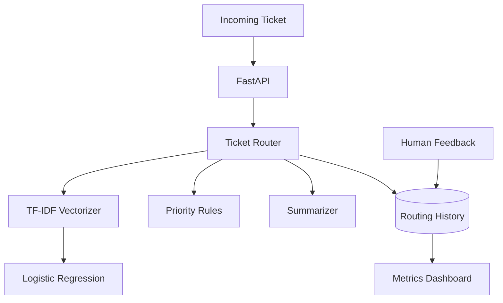

# Architecture

Classification and priority are deliberately separate. The statistical model predicts issue category; deterministic business rules score operational urgency. That keeps escalation policy inspectable rather than hiding it inside the classifier.
